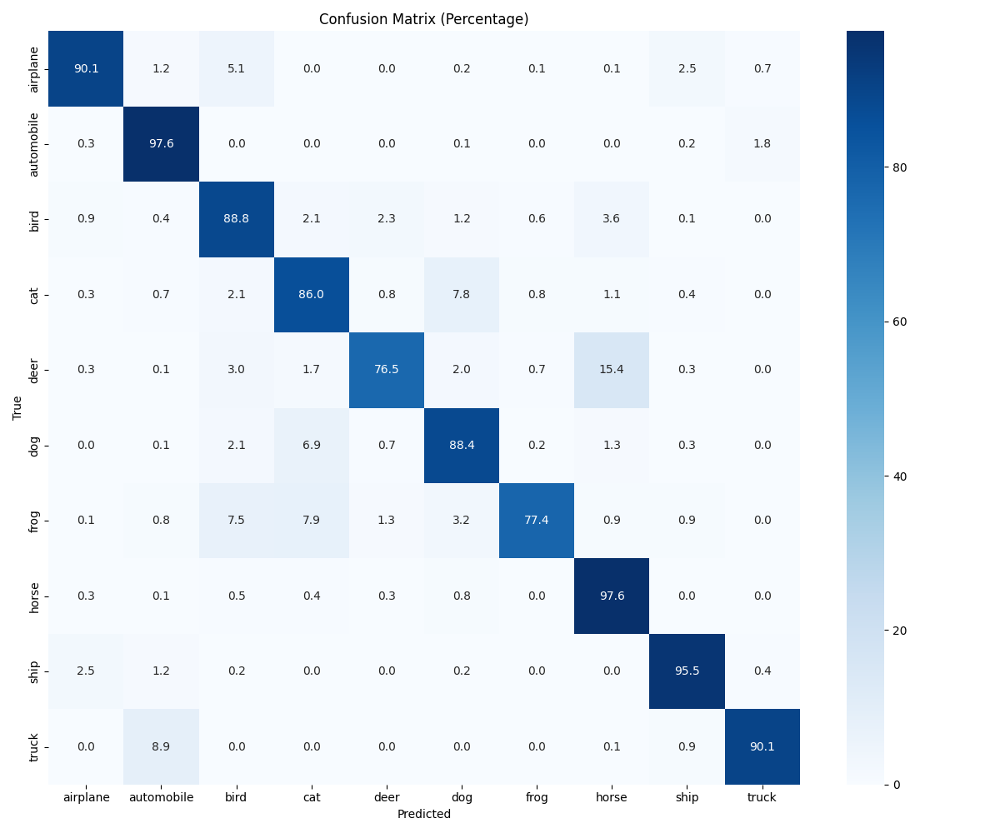

# Agentic-CLIP-Benchmark: Zero-Shot Evaluation on CIFAR-10

[](https://www.python.org/)
[](https://pytorch.org/)
[-green.svg)](https://www.trae.ai/)

This project implements a robust, automated pipeline for evaluating OpenAI's **CLIP (ViT-B/32)** model on the full **CIFAR-10** test set (10,000 images). Developed using an **AI Native workflow (Trae IDE)**, it achieves a high-precision zero-shot accuracy of **88.80%**.

## 📊 Performance Summary
- **Top-1 Accuracy**: `88.80%` (Zero-Shot)
- **Model**: `openai/clip-vit-base-patch32` (using Safetensors)
- **Inference Hardware**: NVIDIA RTX 2060
- **Time Complexity**: Optimized via Batch Inference (Batch Size: 32)

### Confusion Matrix (Statistical Insights)

> **Analysis**: The model shows strong diagonal dominance. Statistical bias is observed between **'Deer'** and **'Horse'** (15.4% overlap), likely due to similar skeletal contours in the ultra-low 32x32 resolution of CIFAR-10. **Automobile** and **Horse** categories achieved the highest precision (97.6%).

---

## 🛠️ Key Features & Methodology
- **Automated Data Pipeline**: Developed a custom `CIFAR10Dataset` to handle raw binary pickle data, converting 1D byte-arrays into 3D RGB tensors efficiently.
- **Batch Reasoning**: Integrated `torch.utils.data.DataLoader` with `tqdm` to manage 10,000 samples without VRAM overflow.
- **Prompt Engineering**: Utilized a descriptive template: `"a photo of a {label}"` to optimize the semantic alignment between text and image embeddings.
- **Precision Metrics**: Integrated `scikit-learn` to compute the confusion matrix, providing a granular look at semantic classification errors.

---

## 🛡️ Battle-Hardened Engineering (Problem Solving)
This project documents the resolution of several production-level challenges encountered during development:

1. **Security (CVE-2025-32434)**: 
   - **Issue**: PyTorch 2.6+ security protocols block insecure `.bin` (Pickle) files.
   - **Solution**: Enforced **Safetensors** format via `use_safetensors=True` for zero-copy, secure model loading.
2. **Environment Robustness (WinError 14007)**: 
   - **Issue**: Windows non-admin accounts lack Symlink permissions for Hugging Face cache.
   - **Solution**: Implemented `HF_HUB_DISABLE_SYMLINKS=1` and established a manual cache cleanup protocol to ensure cross-platform compatibility.
3. **Preprocessing Alignment**: 
   - **Issue**: Identified a **0.06 Accuracy Failure** caused by redundant image rescaling (uint8 vs float normalization).
   - **Solution**: Re-engineered the `CLIPProcessor` pipeline to handle raw `uint8` inputs correctly, successfully restoring accuracy to 88.8%.
4. **Network Optimization**: 
   - **Issue**: Restricted access to Hugging Face Hub under local network constraints.
   - **Solution**: Configured `HF_ENDPOINT` mirror and `local_files_only=True` for high-speed, offline-capable deployment.

---

## 🚀 Getting Started

### 1. Installation
```bash
pip install torch transformers pillow numpy tqdm scikit-learn seaborn matplotlib
```

### 2. Dataset Setup
Download the CIFAR-10 Python version and place the `cifar-10-batches-py` folder in the project root.

### 3. Run Evaluation
```bash
# On Windows, simply run the pre-configured batch file:
.\run.bat

# Or manually via Python:
python full_cifar_clip_eval.py
```

## 📁 Project Structure

```
clip_eval_project/
├── full_cifar_clip_eval.py  # Core evaluation script
├── run.bat                  # One-click run entry
├── confusion_matrix.png     # Confusion matrix result
├── cifar-10-batches-py/     # CIFAR-10 raw data
│   └── test_batch          # Test set data
└── README.md               # Project documentation
```

## 📄 License

This project is licensed under the MIT License. See the [LICENSE](LICENSE) file for details.

## 🙏 Acknowledgments

- OpenAI for developing the CLIP model
- The CIFAR-10 dataset creators
- Hugging Face for the Transformers library
- PyTorch team for the deep learning framework


